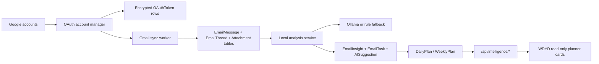
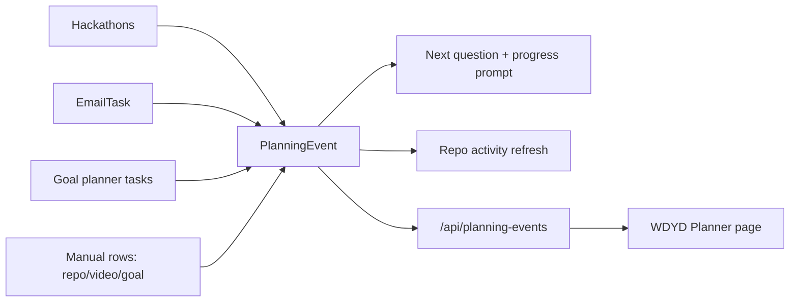

# AiOS Assistant Architecture

This document explains how AiOS Assistant should work as both a standalone app and a plugin-powered local AI agent.

## Product Shape

AiOS Assistant has one local agent core and multiple user-facing surfaces.

```text
Windows Flutter client ----> loopback pairing <---- WDYD Windows app
                                  |
                           Headless AiOS Core
                                  |
                    Agent services + background workers
                                  |
                         SQLite + Ollama local LLM

Linux browser client ------> same Flask service model
```

The local backend is the source of truth. It owns the database, AI classification, reminders, planning logic, and integration rules.

The web app, plugin, and phone UI are clients. They should send data to the backend and display results from it.

## Product Boundary With WDYD

AiOS owns the agent-grade integration layer:

- Google OAuth and multi-account Gmail sync
- encrypted refresh-token storage
- email understanding and semantic search
- daily and weekly planning
- command-planner rows for hackathons, repos, learning videos, email tasks, and goals
- follow-up, waiting-on, and deadline suggestions
- future connectors such as Outlook, Slack, Notion, GitHub, Linear, and Calendar

What Do You Do stays the activity/wellbeing surface. It consumes AiOS intelligence through loopback APIs and never stores Gmail tokens or raw email content.

## Main Components

### 1. Local Backend

Current stack:

- Flask
- Flask-SQLAlchemy
- SQLite

Future stack:

- Flask or FastAPI
- PostgreSQL for long-term storage
- APScheduler or Celery for background jobs
- Redis if queued jobs become necessary

Responsibilities:

- receive inputs
- call the local AI model
- store structured memory
- create reminders
- generate daily plans
- expose API endpoints for app/plugin clients

### 2. Local AI Brain

Recommended local runtime:

- Ollama

The backend talks to Ollama over:

```text
http://localhost:11434
```

The AI should return structured JSON, not casual text.

Example output:

```json
{
  "category": "job",
  "status": "Interview Scheduled",
  "title": "Backend Intern interview",
  "organization": "Example Company",
  "deadline": "2026-06-04T15:00:00",
  "action_needed": "Prepare backend and system design notes",
  "confidence": 0.88
}
```

### Email Intelligence Core



All raw email content stays inside the AiOS local SQLite database. WDYD receives summaries, counts, deadlines, and plan items only.

### Command Planner Core



Each event has deadline, planned start, planned minutes, work done, work left, optional repo URL, latest repo activity, and a next question. WDYD reads this as a dashboard surface; AiOS remains the owner of writes and background enrichment. Repo refresh uses unauthenticated GitHub by default and can use a local `GITHUB_TOKEN` setting for private repos or higher rate limits.

### 3. Web Dashboard

The dashboard is the full app experience.

It should support:

- daily plan
- tracked jobs
- tracked hackathons
- reminders
- recent inbox intelligence
- wellbeing insights
- settings
- plugin connection status

### 4. Browser Plugin

The plugin is a capture layer.

It should be able to:

- capture selected text
- capture job pages
- capture hackathon pages
- capture Gmail thread details when permitted
- send page context to the local backend
- show a small popup summary

The plugin should call local endpoints such as:

```text
POST http://localhost:5000/api/track-job
POST http://localhost:5000/api/track-hackathon
POST http://localhost:5000/api/ingest-email
POST http://localhost:5000/api/wellbeing/activity
GET  http://localhost:5000/api/today
```

Current MVP files:

```text
extension/
  manifest.json
  popup.html
  popup.css
  popup.js
  content.js
```

The popup has four actions:

- Save Page
- Track Job
- Track Hackathon
- Log Activity

The content script reads:

- page title
- primary heading
- selected text
- meta description
- URL
- hostname

Then the popup posts that context to the local Flask API.

### 5. Smartphone / PWA

The phone should use the laptop as the AI server.

```text
Phone browser
        |
http://LAPTOP-IP:5000
        |
Flask backend on laptop
        |
Ollama on laptop
```

This lets the phone access the assistant without running a model locally.

Before exposing the app on LAN, add authentication.

Current mobile route:

```text
GET /mobile
```

PWA files:

```text
app/static/manifest.webmanifest
app/static/service-worker.js
app/static/app.js
app/static/icons/aios-icon.svg
```

The PWA starts on `/mobile` and can be installed from supported mobile browsers.

### 6. Desktop App

Windows uses a native Flutter client and a separate headless local core. Linux
keeps the Flask/browser client on the `linux-browser` branch.

```text
aios_assistant.exe (Flutter)
        |
discovers or starts adjacent AiOS-Core.exe
        |
pairing token on an available 127.0.0.1 port
        |
SQLite, Gmail OAuth, Ollama and workers
        |
Flutter renders Overview, Inbox, Opportunities, Projects, College,
Accounts and Settings without an embedded browser
```

Desktop persistence:

```text
Windows
  data:   %LOCALAPPDATA%\AiOS Assistant
  config: %APPDATA%\AiOS Assistant

Linux / Arch
  data:   $XDG_DATA_HOME/aios-assistant
  config: $XDG_CONFIG_HOME/aios-assistant
  cache:  $XDG_CACHE_HOME/aios-assistant
```

`aios_core.spec` packages the Windows service core. Flutter produces the native
client and its DLL/data directory. `scripts/build-windows-native.ps1` assembles
both into one installable release. The older `desktop_app.spec` remains only on
the Linux/browser migration line.

Windows installation is per-user:

```text
native_app/windows/install/install.ps1
        |
copies aios_assistant.exe + AiOS-Core.exe to %LOCALAPPDATA%\Programs\AiOS Assistant
        |
creates Start Menu and Desktop shortcuts
        |
native Settings can create a background Startup launcher
```

The native desktop shell keeps a tray icon alive. Close/minimize hides the
window while services keep running; explicit exit is available from Settings
and the tray menu.

Arch/Linux installation uses `packaging/linux/install-arch.sh`, installs the
binary under `$HOME/.local/bin`, registers a desktop entry, and can opt into
login startup with `--enable-startup`.

## Real-Time Layer

Current live behavior:

- native Flutter UI polls local summary APIs every 12 seconds
- Linux/browser stats update without a full page refresh on its branch
- `local_worker.py` checks reminders every 30 seconds
- `AiOS-Core.exe` starts reminders, import watching, opportunity scanning, email intelligence, and activity tracking automatically
- desktop notifications use `plyer` when available and terminal output as a fallback
- reminders are marked read after notification so the same reminder is not repeatedly sent

Reminder state:

- `is_read`: user has seen it, so workers should not notify again.
- `is_done`: task is complete.
- `notified_at`: when the desktop worker or reminder connector last notified.

Live endpoint:

```text
GET /api/live
```

Returns:

- current plan
- dashboard stats
- latest opportunity
- latest wellbeing activity
- top reminders
- update timestamp

## Data Flow

### Real Data Sources

Current real input sources:

```text
Browser extension
Local file import
Watch folder import
Desktop activity worker
Manual dashboard/mobile capture
Connector registry
```

Near-future real input sources:

```text
Gmail OAuth
Google Calendar
Android wellbeing export
Local filesystem watch folders
```

### Email Flow

```text
Gmail/local email/manual paste/file import
        |
Backend ingest endpoint
        |
Local AI classifier
        |
InboxItem saved
        |
Opportunity and Reminder created when useful
        |
Dashboard and daily plan update
```

### Local Import Flow

```text
.eml / .mbox / .json / .csv
        |
/sources/import
        |
data_pipelines.py parser
        |
agent_ingest.py
        |
local AI classifier
        |
InboxItem + Opportunity + Reminder + AgentDecision
```

### Watch Folder Flow

```text
watch_import_worker.py
        |
WATCH_IMPORT_DIR
        |
.eml / .mbox / .json / .csv
        |
data_pipelines.py parser
        |
agent_ingest.py
        |
live dashboard
```

The desktop wrapper starts this worker automatically. Browser mode can run it separately.

### Worker Control Flow

```text
/workers
        |
workers.py
        |
shows desktop-managed services when desktop_app.py is running
        |
can start/stop standalone Python worker processes in browser/dev mode
        |
.aios_workers.json PID state
```

Managed workers:

- reminder worker
- desktop activity worker
- watch import worker
- opportunity monitor

### Settings Flow

```text
/settings
        |
Setting table
        |
get_effective_config()
        |
connectors + classifier + watch worker
        |
startup.py creates/removes OS login launcher
```

### Local Auth Flow

```text
/login
        |
PIN hash in Setting table
        |
Flask session unlock
        |
dashboard + mobile + API access
```

The PIN lock is local-session protection. Before public exposure, add per-client API tokens and HTTPS.

### Connector Flow

```text
/connectors or /api/connectors/<id>/run
        |
connectors.py registry
        |
source-specific connector
        |
agent_ingest.py or notification service
        |
ConnectorRun history
```

Current connectors:

- Gmail connector: local Gmail Takeout `.mbox` import now, OAuth credential paths prepared.
- Reminder connector: checks reminders and triggers local notifications.
- Job portal connector: imports saved `.json` and `.csv` exports, plus extension live capture.

### Desktop Activity Flow

```text
desktop_activity_worker.py
        |
active window title
        |
category heuristic
        |
ActivityEvent
        |
dashboard/mobile live update
```

### Job Page Flow

```text
User opens job page
        |
Plugin captures title, company, deadline, URL, selected notes
        |
Plugin sends data to backend
        |
AI extracts role/status/action
        |
Opportunity saved
        |
Follow-up reminder created
```

### Hackathon Flow

```text
User opens Devfolio/Unstop/hackathon page
        |
Plugin sends context to backend
        |
AI extracts event name, team info, phases, deadline
        |
Hackathon opportunity saved
        |
Timeline generated:
- idea
- prototype
- pitch deck
- demo
- submission
```

### Digital Wellbeing Flow: "What Do You Do"

The Digital Wellbeing integration should compare planned work with actual behavior.

```text
Daily plan
        |
User activity signal
        |
Wellbeing analyzer
        |
Mismatch detection
        |
Plan adjustment or reminder
```

Example:

```text
Planned:
- 90 min interview prep
- 45 min DSA

Observed:
- 50 min social media
- 10 min coding

Agent action:
- mark focus drift
- suggest a 25 min recovery block
- move DSA later
- show a short reminder
```

Possible activity sources:

- browser plugin reports active site category
- Android Digital Wellbeing export/manual input
- desktop app usage tracker
- user check-in prompt: "What are you doing right now?"
- calendar/focus timer session

Important privacy rule:

The wellbeing data should stay local by default.

## Memory Model

Phase 1 persistent memory tables:

```text
MemoryEntity
MemoryFact
MemoryRelation
WorkCheckpoint
```

`MemoryEntity` represents the user, projects, goals, skills, job applications,
learning paths, preferences, and recurring tasks. The local user node is
created automatically and new entities receive typed graph relationships.

`MemoryFact` stores durable notes, decisions, preferences, and searchable
checkpoint text. Embeddings are stored alongside the SQLite record, so vector
indexes are disposable accelerators rather than the source of truth.

`WorkCheckpoint` stores:

- last project summary
- open files
- active tasks
- next actions
- resume notes
- checkpoint source and timestamp

Retrieval flow:

```text
Natural-language question
        |
Intent matcher for yesterday / unfinished / next step
        |
Lexical scoring + Ollama query embedding
        |
ChromaDB -> FAISS -> Python cosine fallback
        |
SQLite entities, facts, relations, and checkpoints
        |
Grounded local answer with matching records
```

## Local-First Security

Rules:

- Keep AI inference local by default.
- Do not expose Flask publicly without authentication.
- Do not store raw email bodies longer than needed unless the user enables it.
- Keep OAuth secrets in `.env`.
- Use LAN access only for trusted devices.
- Add auth before phone/PWA usage.

## Build Order

1. Add Ollama classifier. Done in initial phase.
2. Add stable JSON schema for AI outputs. Done in initial phase.
3. Add local API endpoints. Started in initial phase.
4. Add Digital Wellbeing activity tables. Started in initial phase.
5. Add plugin MVP.
6. Add phone/PWA support.
7. Add auth.
8. Add Gmail import.
9. Add Calendar integration.
10. Add optional Telegram notifications.

## Initial Build Phase Status

Implemented:

- `AI_PROVIDER=ollama` support with rule-based fallback
- structured classification fields
- `AgentDecision` storage
- `ActivityEvent` storage
- `POST /api/ingest-email`
- `POST /api/track-job`
- `POST /api/track-hackathon`
- `POST /api/wellbeing/activity`
- `GET /api/today`
- `GET /api/opportunities`
- Digital Wellbeing panel on the dashboard
- browser extension MVP for page/job/hackathon/wellbeing capture
- PWA manifest and service worker
- phone-first `/mobile` dashboard
- native Flutter Windows launcher with a headless local core
- live dashboard polling
- local reminder worker
- desktop notification foundation
- local import pipeline for `.eml`, `.mbox`, `.json`, `.csv`
- desktop activity worker for real wellbeing data

Next:

- improve the browser plugin with context menus and richer Gmail/job-page extraction
- add authentication before LAN/mobile use
- add a real migration workflow before the database schema becomes larger
