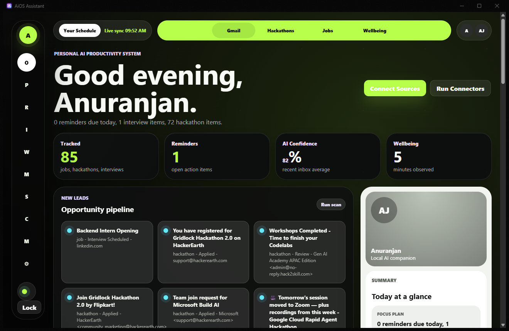
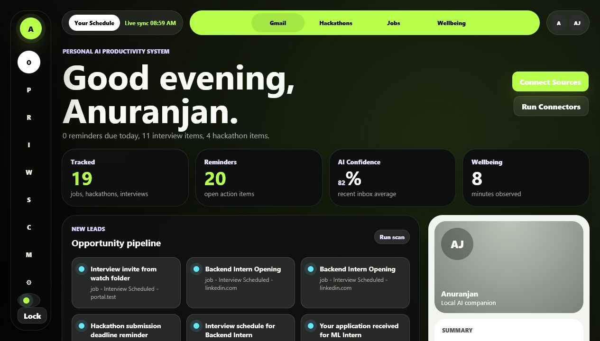

# AiOS Assistant

AiOS Assistant is a local-first AI productivity agent. The goal is to make it work both as a normal standalone web app and as a lightweight plugin/extension that can send useful context into the same local agent brain.

It is designed to become a personal executive assistant for:

- Email intelligence
- Job application tracking
- Hackathon tracking
- Smart reminders
- Daily planning
- Calendar-ready scheduling
- Digital wellbeing and focus tracking

## Demo

| Native Windows dashboard | Native AI goal planner |
| --- | --- |
|  |  |

| Workspace dashboard | Mobile dashboard |
| --- | --- |
|  |  |

The current UI is a dark workspace-style command center inspired by compact agent dashboards:

- neon-lime command rail and schedule strip
- opportunity cards for jobs, interviews, and hackathons
- local reminders, source connectors, and live pipeline runs
- right-side agent summary panel
- mobile dashboard for phone or LAN access

## MVP Features

- Classifies incoming email-like messages into jobs, hackathons, interviews, rejections, deadlines, and general updates.
- Stores tracked opportunities in SQLite.
- Persists personal memory, projects, goals, skills, learning paths, preferences, recurring tasks, and work checkpoints.
- Generates daily summaries and simple schedule recommendations.
- Exposes a clean Flask dashboard.
- Includes integration placeholders for Gmail, Google Calendar, Telegram, local AI, and plugin clients.

## Vision

AiOS Assistant should have one shared local backend and multiple surfaces:

```text
Ollama / local model
        ^
Flask agent backend
        ^
SQLite / PostgreSQL + scheduler
        ^
Local API endpoints
   /                  \
Web dashboard      Browser/mobile/plugin clients
```

The separate web app is the main dashboard. It shows tracked jobs, hackathons, reminders, plans, and recent AI decisions.

The plugin is a companion layer. It should capture useful context from places like Gmail, LinkedIn, Unstop, Devfolio, job pages, or a Digital Wellbeing-style app, then send that context to the local backend.

The plugin should stay thin. It should not contain the whole AI system. The AI logic, memory, database, and planner live in the local backend.

## Local-First AI

The preferred workflow is fully local for AI reasoning:

```text
Email / page / wellbeing signal
        |
Local Flask backend
        |
Ollama model on this machine
        |
Structured result saved to database
        |
Dashboard, reminders, and daily plan update
```

This avoids sending private emails, schedules, habits, and productivity data to cloud AI providers.

Recommended local model runner:

- Ollama

Recommended starter models:

- `qwen2.5:7b`
- `llama3.1:8b`
- `mistral:7b`
- `phi3:mini` for lighter machines

Cloud models can still be optional later, but local AI should be the default.

## Quick Start

```powershell
python -m venv .venv
.\.venv\Scripts\Activate.ps1
pip install -r requirements.txt
copy .env.example .env
flask --app app run --debug
```

Open:

```text
http://127.0.0.1:5000
```

Mobile dashboard:

```text
http://127.0.0.1:5000/mobile
```

If using Ollama locally, make sure Ollama is running:

```text
http://localhost:11434
```

Later, set:

```env
AI_PROVIDER=ollama
OLLAMA_MODEL=qwen2.5:7b
```

Pull the model once:

```powershell
ollama pull qwen2.5:7b
```

If Ollama is not running or the model is not available, the app falls back to the built-in rule-based classifier so the dashboard and APIs still work.

## Phase 1: Persistent Personal Memory

The Memory workspace is available at:

```text
http://127.0.0.1:5000/memory
```

It stores durable local records for:

- user preferences
- projects and project status
- goals and skills
- learning paths
- recurring tasks
- job applications
- session checkpoints, open files, active tasks, notes, and next actions

Example checkpoint:

```json
{
  "project_name": "AiOS Project",
  "summary": "Built the persistent memory schema",
  "open_files": ["app/services/memory_engine.py", "app/routes.py"],
  "active_tasks": ["Implement memory layer"],
  "next_actions": ["Add Ollama embeddings", "Test reboot persistence"]
}
```

The local query API understands intent-aware questions such as:

```text
What was I doing yesterday?
Show unfinished projects.
What was the next step for AiOS Project?
```

Memory storage layers:

1. SQLite is the authoritative structured store and survives reboots.
2. Ollama `nomic-embed-text` creates local embeddings when available.
3. ChromaDB is the preferred optional persistent vector accelerator.
4. FAISS is the optional in-process fallback.
5. Lexical and intent search remain available without any vector package.

Install the optional vector engines:

```powershell
pip install -r requirements-memory.txt
ollama pull nomic-embed-text
```

Choose a backend with `MEMORY_VECTOR_BACKEND=auto`, `chroma`, `faiss`, or `sqlite`.

Memory APIs:

```text
GET  /api/memory
POST /api/memory/entities
POST /api/memory/facts
POST /api/memory/checkpoints
POST /api/memory/relations
GET  /api/memory/graph
GET  /api/memory/search?q=...
POST /api/memory/ask
```

## Phase 2: AI Goal Planner

Open the adaptive planner at:

```text
http://127.0.0.1:5000/planner
```

Give AiOS a broad goal such as `I want to learn Operating Systems`. It creates
a daily, weekly, or monthly roadmap and persists:

- ordered roadmap periods and tasks
- Not Started, In Progress, and Completed states
- start and completion times
- logged work sessions and total time spent
- resources used
- learning or project summaries
- the next suggested task based on current progress

When Ollama is selected, AiOS asks the configured local model to generate the
roadmap. A deterministic local roadmap generator remains available when Ollama
is offline.

Planner APIs:

```text
GET   /api/planner
POST  /api/planner
PATCH /api/planner/tasks/<task_id>
POST  /api/planner/tasks/<task_id>/sessions
```

## Smartphone Access

The phone does not need to run the AI model. The laptop or PC runs Flask and Ollama, and the phone opens the dashboard over the same Wi-Fi.

```text
Phone browser
        |
http://LAPTOP-IP:5000
        |
Flask app on laptop
        |
Ollama on laptop
```

To support this, run Flask on all network interfaces:

```env
HOST=0.0.0.0
PORT=5000
```

Then open this on the phone:

```text
http://YOUR-LAPTOP-IP:5000/mobile
```

The mobile dashboard is PWA-ready. In Chrome on Android, open the mobile URL, open the browser menu, and choose Add to Home screen or Install app.

## Desktop App

AiOS ships as one Python desktop codebase for Windows and Linux. The native shell uses `pywebview`; Flask, SQLite, Ollama integration, memory, connectors, and workers remain shared with the web/PWA surfaces.

```powershell
python desktop_app.py
```

The desktop runtime:

- opens AiOS in a native window
- selects an available loopback-only port
- starts reminder, watch-folder, and opportunity monitor services
- publishes a loopback-only pairing endpoint for the local `What Do You Do` collector
- uses SQLite WAL mode so Gmail scans and activity sync can write safely together
- stops background threads when the window closes
- supports packaged worker processes from the Workers page
- falls back to the system browser when a native webview is unavailable

Persistent desktop data is stored outside the installation directory:

```text
Windows: %LOCALAPPDATA%\AiOS Assistant
Arch:   ~/.local/share/aios-assistant
```

Configuration and OAuth credentials:

```text
Windows: %APPDATA%\AiOS Assistant
Arch:   ~/.config/aios-assistant
```

This keeps the SQLite database, memory vectors, imports, worker state, and Gmail tokens intact when the application is upgraded.

Move an existing development profile into desktop storage once:

```powershell
.\AiOS-Assistant.exe --migrate .
```

For source/Arch installations, use:

```bash
python scripts/migrate-desktop-data.py --source .
```

The migration copies only missing files. It never replaces an existing desktop database or credential file. Windows packaged migration runs inside the executable so Microsoft Store Python path virtualization cannot redirect the data.

### Build for Windows

Build on Windows:

```powershell
.\scripts\build-desktop.ps1
```

Output:

```text
release\AiOS-Assistant-windows-x64.zip
```

Windows 10/11 normally includes Microsoft Edge WebView2. If it is missing, install the WebView2 Runtime before launching AiOS.

### Build for Arch Linux

Build on Arch because PyInstaller does not cross-compile Linux executables from Windows:

```bash
sudo pacman -S --needed python python-pip gtk3 webkit2gtk python-gobject \
  libnotify base-devel
./scripts/build-desktop-arch.sh
```

Output:

```text
release/AiOS-Assistant-arch-x86_64.tar.gz
```

Install the extracted build for the current user:

```bash
tar -xzf release/AiOS-Assistant-arch-x86_64.tar.gz
./install-arch.sh
```

The launcher is then available from the desktop application menu as `AiOS Assistant`.

Development dependencies and frozen-build tooling:

```powershell
pip install -r requirements-desktop.txt
```

## Real-Time Local Mode

The dashboard and mobile dashboard poll the local backend every 15 seconds through:

```text
GET /api/live
```

This keeps key stats and the daily plan fresh without manually refreshing the page.

Run the reminder worker separately when using the browser-based app:

```powershell
python local_worker.py
```

The worker checks every 30 seconds for reminders due in the next 10 minutes. It sends a desktop notification when possible and falls back to terminal output.

Reminder states:

- Read: stop future notifications for that reminder, but keep the reminder visible.
- Done: complete the reminder and also mark it read.

For the all-in-one desktop experience, use:

```powershell
python desktop_app.py
```

Track real desktop activity:

```powershell
python desktop_activity_worker.py
```

This watches the active window title locally and logs Digital Wellbeing events when you spend at least 60 seconds in a window.

Auto-import real files from a watch folder:

```powershell
python watch_import_worker.py
```

By default it watches `imports/watch`. Drop `.eml`, `.mbox`, `.json`, or `.csv` files there and AiOS imports each file once.

Worker control UI:

```text
http://127.0.0.1:5000/workers
```

From there you can start/stop the reminder worker, desktop activity worker, and watch import worker.

Worker API:

```text
GET  /api/workers
POST /api/workers/reminders/start
POST /api/workers/reminders/stop
POST /api/workers/activity/start
POST /api/workers/activity/stop
POST /api/workers/watch_imports/start
POST /api/workers/watch_imports/stop
```

Packaging starter:

```powershell
pip install pyinstaller
pyinstaller desktop_app.spec
```

## Project Structure

```text
app/
  __init__.py
  models.py
  routes.py
  services/
    ai_classifier.py
    daily_planner.py
    reminder_engine.py
    integrations.py
  templates/
    dashboard.html
  static/
    styles.css
config.py
run.py
desktop_app.py
desktop_app.spec
watch_import_worker.py
requirements.txt
.env.example
ARCHITECTURE.md
extension/
  manifest.json
  popup.html
  popup.css
  popup.js
  content.js
```

## Core Workflow

```text
1. Input arrives
   - Gmail email
   - manually pasted email
   - job page from plugin
   - hackathon page from plugin
   - calendar event
   - Digital Wellbeing activity signal

2. Local agent classifies the input
   - job application
   - interview
   - rejection
   - hackathon
   - deadline
   - distraction/focus signal
   - general reminder

3. Database is updated
   - inbox item
   - opportunity
   - reminder
   - wellbeing event

4. Planner generates actions
   - follow up after 7 days
   - prepare for interview
   - schedule DSA block
   - reduce distracting app time
   - protect project/deep-work time

5. User sees output
   - dashboard
   - local notification
   - Telegram message, optional
   - mobile/PWA view
```

## Real Data Pipelines

The app should not depend on fake seed data. Current real-data inputs are:

- Browser extension: captures real web pages, selected text, job pages, hackathons, and activity signals.
- Local import page: imports `.eml`, `.mbox`, `.json`, and `.csv` files.
- Watch folder worker: imports real files dropped into `imports/watch`.
- Desktop activity worker: records active desktop window time into wellbeing events.
- Manual capture: paste an actual email/job/deadline into the dashboard or mobile dashboard.

Open:

```text
http://127.0.0.1:5000/sources
```

Settings:

```text
http://127.0.0.1:5000/settings
```

Use settings to configure the AI provider, Ollama URL/model, Gmail Takeout mbox path, Gmail OAuth paths, job portal import folder, and watch import folder.

Security:

- Open `/settings` to enable a local PIN.
- When enabled, dashboard/mobile/API routes require an unlocked browser session.
- Use the Lock button in the sidebar or mobile page to clear the session.
- Keep AiOS bound to loopback by default. Browser API calls are accepted only from the AiOS UI, the local What Do You Do frontend, or a token-authenticated extension.

Supported import formats:

- `.eml`: one exported email file.
- `.mbox`: mailbox export, such as Google Takeout mail export.
- `.json`: list of objects with `sender`/`from`, `subject`/`title`, and `body`/`content` fields.
- `.csv`: columns like `sender`, `subject`, `body` or `from`, `title`, `notes`.

The import pipeline sends each record through the same local classifier and saves real inbox items, opportunities, reminders, and agent decisions.

Watch-folder flow:

```text
imports/watch/*.csv
        |
watch_import_worker.py
        |
local classifier
        |
database + live dashboard
```

## Connectors

Open:

```text
http://127.0.0.1:5000/connectors
```

Current connectors:

- Gmail: imports real Gmail Takeout `.mbox` when `GMAIL_MBOX_PATH` is set. OAuth credential paths are reserved for the next Gmail API step.
- Local Reminders: checks open reminders and sends desktop notifications.
- Job Portals: imports `.json` or `.csv` exports dropped into `imports/job_portals`, and works with the browser extension for live capture.

Connector API:

```text
GET  /api/connectors
POST /api/connectors/gmail/run
POST /api/connectors/reminders/run
POST /api/connectors/job_portals/run
```

Gmail local export setup:

```env
GMAIL_MBOX_PATH=C:\path\to\All mail Including Spam and Trash.mbox
```

Job portal export setup:

```text
imports/job_portals/
  linkedin_jobs.csv
  internshala_saved_jobs.json
```

## Digital Wellbeing App: "What Do You Do"

The Digital Wellbeing connection should answer one main question:

```text
What do you do with your time, and does it match what you planned to do?
```

The wellbeing app or plugin can send activity signals into AiOS Assistant:

- current app or website category
- time spent
- focus session start/end
- distraction spikes
- planned task versus actual task
- user check-in such as "what are you doing right now?"

AiOS Assistant can then compare activity with the daily plan.

Example:

```text
Plan:
- 90 min interview prep
- 60 min project work
- 45 min DSA

Observed:
- 35 min YouTube
- 20 min Instagram
- 15 min VS Code

Agent response:
- You are drifting from the interview-prep block.
- Start a 25 min prep sprint now.
- Move DSA to 9:30 PM.
```

This makes the assistant more than a reminder app. It becomes a feedback loop between intention and actual behavior.

### Local `What Do You Do` Bridge

`What Do You Do` connects from the local Vite app to AiOS Assistant:

1. It calls `GET /api/live` to confirm AiOS is running.
2. If the local PIN is enabled and AiOS is locked, the API returns `401`.
3. After the user unlocks AiOS in the browser, the wellbeing dashboard can call `POST /api/wellbeing/activity`.
4. AiOS stores the event locally as an `ActivityEvent` and includes it in dashboard/mobile live state.

For collector-level background sync, start both desktop apps. AiOS generates a private local API token and `What Do You Do` discovers the active loopback instance automatically. Manual `WDYD_AIOS_URL` and `WDYD_AIOS_API_TOKEN` values remain available as overrides.

The CORS layer uses an explicit local-origin allowlist and rejects other browser origins. Extension API writes require `X-AiOS-Token`. Do not expose this API outside a trusted local device without HTTPS and a rotated per-client token.

## Live Opportunity Monitor

AiOS now acts as the local source-of-truth for the `What Do You Do` Hackathon Corner and placement/company tracker.

It tracks:

- applications and registrations
- shortlist or qualification updates
- team invitations
- submission and deadline messages
- submitted projects and result announcements
- company applications
- online assessment and test links
- interview rounds
- rejection, offer, and follow-up emails
- unread source updates

### Real Gmail test flow

AiOS can scan your actual Gmail inbox with Google's read-only Gmail API. It does not need your Gmail password, and it does not send email content to OpenAI/Gemini when `AI_PROVIDER=rule_based` or local Ollama is used.

1. Enable the Gmail API in Google Cloud.
2. Create OAuth credentials for a desktop application.
3. Place the downloaded file at `credentials/google_client_secret.json`.
4. Install dependencies:

```powershell
python -m pip install -r requirements.txt
```

5. Start AiOS:

```powershell
python run.py
```

6. Open `http://127.0.0.1:5000/connectors`.
7. Open **Connectors** and choose **Connect Google**. Approve the read-only Google consent screen.
8. Leave AiOS Desktop running. The opportunity monitor refreshes Gmail automatically every 15 minutes by default.
9. Check the live feeds:

```text
GET http://127.0.0.1:5000/api/hackathons
GET http://127.0.0.1:5000/api/placements
```

After first approval, Google stores a local OAuth token in the operating-system AiOS configuration directory. Use **Disconnect** on the Connectors page to remove it.

The default Gmail query scans the past year for:

- Unstop, Hack2Skill, HackerEarth, Devfolio, and Devpost updates
- hackathon, shortlist, submission, result, and deadline subjects
- placement, application, interview, assessment, offer, rejection, and internship subjects

Override it with `GMAIL_OPPORTUNITY_QUERY`. Existing `GMAIL_HACKATHON_QUERY` still works as a backward-compatible fallback.

The integration uses the read-only Gmail scope. Gmail message IDs are stored as deduplication keys, so repeated scans do not create repeated updates.

### Placement company tracker

Placement updates are stored as company/application timelines. Each timeline tracks:

- current status: Applied, OA Received, Shortlisted, Interview Scheduled, Rejected, Offer, Deadline, or Tracked
- source connector and latest Gmail/platform update
- unread updates, so repeated notifications can be muted after review
- optional deadline
- next action suggested by the local rule engine

Supported APIs:

```text
GET  /api/placements
POST /api/placements/capture
POST /api/placements/refresh
POST /api/placement-updates/{id}/read
```

### Platform monitoring

Unstop, Hack2Skill, and HackerEarth do not provide one common stable API for every user application workflow. AiOS therefore uses two local paths:

- the browser extension automatically captures supported hackathon pages when you visit them
- `.json` or `.csv` exports can be placed in `imports/hackathons`

Supported export columns include:

```text
id,title,organizer,platform,status,deadline,url,notes,updated_at
```

The extension supports Unstop, Hack2Skill, HackerEarth, Devfolio, and Devpost. Enable `Auto-capture hackathon pages` in the popup and configure the local API token; extension writes are rejected without it. The token stays in device-only extension storage and is not stored in browser sync.

### APIs

```text
GET  /api/hackathons
POST /api/hackathons/capture
POST /api/hackathons/refresh
POST /api/hackathon-updates/{id}/read
```

`What Do You Do` polls the feed every 30 seconds and can trigger an immediate local source scan.

## Plugin Workflow

The plugin should send context to the local backend:

```text
Browser plugin
        |
POST http://localhost:5000/api/ingest
        |
AiOS Assistant backend
        |
Local AI classifier
        |
Database + reminders + planner
```

Example plugin actions:

- Save this job page
- Track this hackathon
- Summarize this Gmail thread
- Create reminder from selected text
- Send current activity to wellbeing tracker

## Browser Extension MVP

The first plugin version lives in:

```text
extension/
```

Load it in Chrome or Edge:

1. Open `chrome://extensions` or `edge://extensions`.
2. Enable Developer mode.
3. Choose Load unpacked.
4. Select the `extension` folder from this project.
5. Keep the Flask app running at `http://127.0.0.1:5000`.

Popup actions:

- Save Page: sends current page title, URL, selected text, and meta description to `/api/ingest-email`.
- Track Job: sends the same page context to `/api/track-job`.
- Track Hackathon: sends the same page context to `/api/track-hackathon`.
- Log Activity: sends the current site and selected activity category to `/api/wellbeing/activity`.

The extension stores only the local API base URL in browser sync storage. The captured page data is sent to your local Flask backend.

## API Direction

Future local API endpoints:

```text
POST /api/ingest-email
POST /api/track-job
POST /api/track-hackathon
POST /api/wellbeing/activity
GET  /api/today
GET  /api/opportunities
```

Current API examples:

```powershell
Invoke-RestMethod -Method Post http://127.0.0.1:5000/api/ingest-email `
  -ContentType "application/json" `
  -Body '{"sender":"talent@example.com","subject":"Interview schedule for AI Intern","body":"Technical round tomorrow at 4 PM.","source":"manual test"}'
```

```powershell
Invoke-RestMethod -Method Post http://127.0.0.1:5000/api/wellbeing/activity `
  -ContentType "application/json" `
  -Body '{"source":"what-do-you-do","app_name":"YouTube","category":"entertainment","duration_minutes":35,"planned_task":"interview prep","actual_task":"watching videos"}'
```

```powershell
Invoke-RestMethod http://127.0.0.1:5000/api/today
```

## Roadmap

1. Add Ollama classifier and make local AI the default.
2. Add Gmail import or local email import.
3. Add local API endpoints for plugin clients.
4. Build browser plugin for Gmail/job/hackathon pages.
5. Add Digital Wellbeing activity ingestion.
6. Add mobile/PWA support.
7. Add desktop app wrapper.
8. Add Google Calendar event creation.
9. Add local auth before exposing to phone or LAN.
10. Add optional Telegram notifications.

See [ARCHITECTURE.md](ARCHITECTURE.md) for the full architecture.
