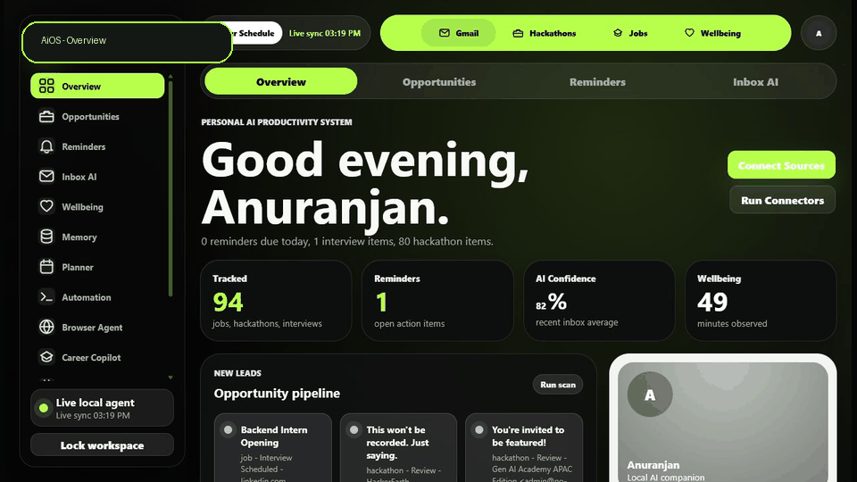
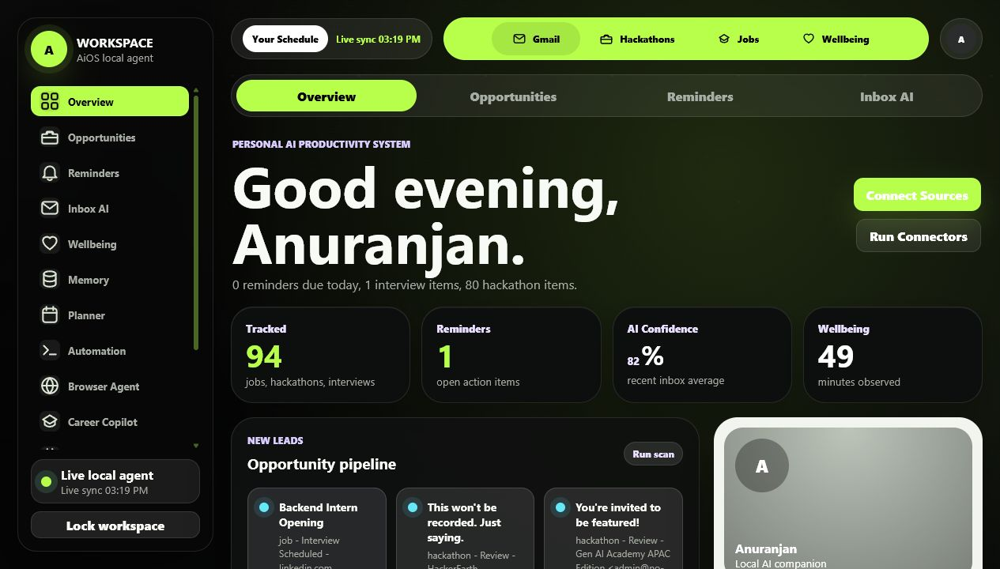
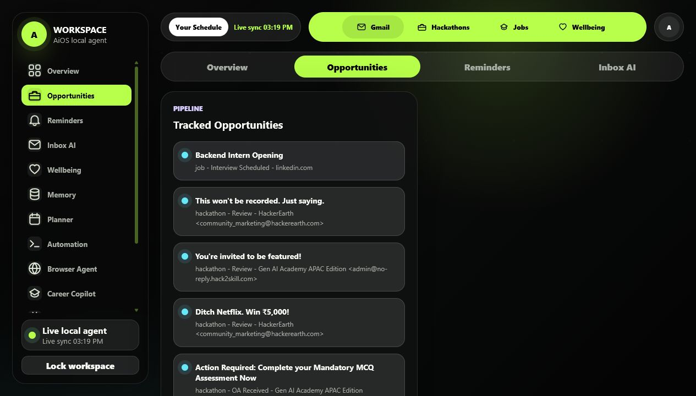
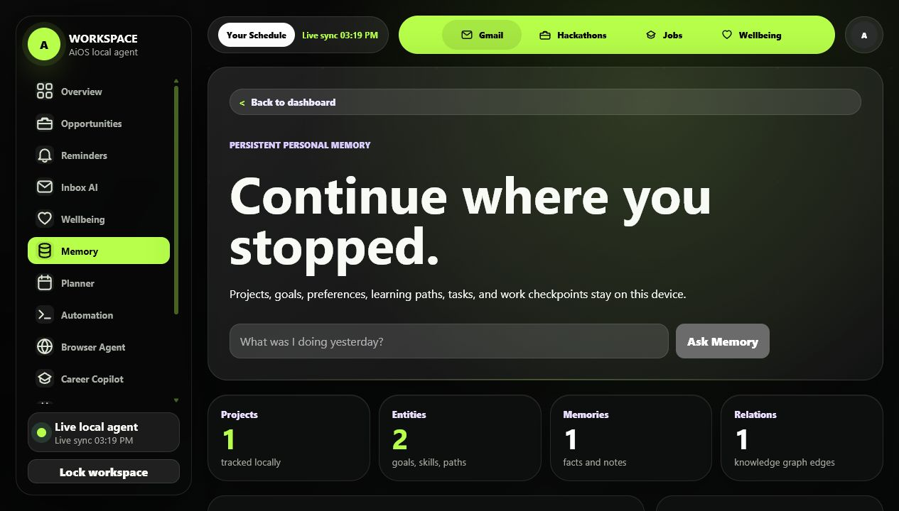
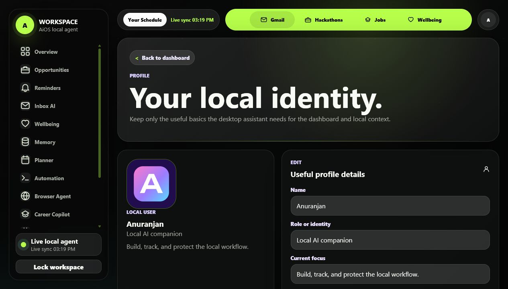
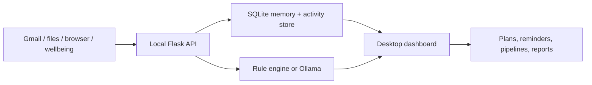
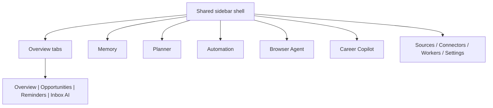

# AiOS Assistant

> A local-first desktop command center for memory, planning, mail signals, hackathons, jobs, wellbeing, and tiny agent chores.

AiOS is the personal assistant layer for **What Do You Do** and the wider AiOS idea: it runs on your machine, keeps data local, and turns scattered signals into a clean daily workspace.

<p align="center">
  
</p>

## The Vibe

| Overview | Opportunities |
| --- | --- |
|  |  |

| Memory | Profile |
| --- | --- |
|  |  |

## What It Does

- Remembers projects, goals, learning paths, notes, and next actions.
- Tracks hackathons, job updates, Gmail signals, reminders, and wellbeing events.
- Runs local desktop automation previews before touching files.
- Plans goals into daily, weekly, or monthly roadmaps.
- Connects with Gmail OAuth and local import folders.
- Keeps AI local-first with Ollama support and rule-based fallback.
- Ships as an installable Windows desktop app plus Arch/Linux packaging.

## Local-First Workflow



## Desktop Shell



Everything important now uses the same shell, top pipeline rail, profile button, and smooth page motion.

## Quick Start

```powershell
python -m venv .venv
.\.venv\Scripts\Activate.ps1
pip install -r requirements.txt
copy .env.example .env
python run.py
```

Open:

```text
http://127.0.0.1:5000
```

Run the packaged desktop build:

```powershell
.\release\AiOS-Assistant.exe
```

Build and install the desktop app:

```powershell
.\scripts\build-desktop.ps1
.\scripts\install-desktop.ps1 -EnableStartup
```

The installer copies `AiOS-Assistant.exe` to `%LOCALAPPDATA%\Programs\AiOS Assistant`, adds Start Menu/Desktop shortcuts, and can enable login startup. The startup launcher opens AiOS in background tray mode; closing the desktop window hides it to the tray until you use **Exit AiOS** from Settings or the tray menu. When the desktop app starts, it owns the background loops for reminders, imports, opportunities, and activity tracking.

Arch/Linux:

```bash
./scripts/build-desktop-arch.sh
tar -xzf release/AiOS-Assistant-arch-x86_64.tar.gz -C /tmp/aios
/tmp/aios/install-arch.sh --enable-startup
```

## Optional Local AI

AiOS works without a model by using deterministic local rules. For local LLM planning/classification:

```powershell
ollama pull qwen2.5:7b
ollama pull nomic-embed-text
```

Set in `.env`:

```env
AI_PROVIDER=ollama
OLLAMA_MODEL=qwen2.5:7b
OLLAMA_EMBED_MODEL=nomic-embed-text
```

## Repo Map

```text
app/
  routes.py              Desktop pages, API endpoints, OAuth routes
  models.py              SQLite models
  services/              Memory, planner, connectors, workers, settings
  templates/             Shared desktop shell and pages
  static/                CSS, JS, manifest, icons

automation_agent/        Local file and office automation tools
browser_agent/           Browser research and job tracking planner
career_agent/            GitHub, resume, roadmap, and job match logic
docs/                    Architecture, QA, screenshots, module specs
extension/               Browser/plugin companion surface
packaging/               Desktop release helpers
tests/                   Regression and integration tests
```

## Main Pages

| Page | Purpose |
| --- | --- |
| `/` | Desktop overview with tabbed Overview, Opportunities, Reminders, Inbox AI |
| `/gmail` | Gmail intelligence feed |
| `/hackathons` | Hackathon corner |
| `/jobs` | Placement and job tracker |
| `/wellbeing` | What Do You Do / activity signals |
| `/memory` | Persistent personal memory |
| `/planner` | Goal planner |
| `/automation` | Desktop automation preview and approval |
| `/browser-agent` | Browser research and job search agent |
| `/career` | Career Copilot |
| `/profile` | Name, role, current focus, profile photo |
| `/connectors` | Gmail and import connectors |
| `/workers` | Desktop background service status |
| `/settings` | Local config, PIN lock, desktop startup |

## Safety Notes

- Credentials stay out of git: `credentials/`, `.env`, `instance/`, `release/`, `dist/`, and `build/` are ignored.
- Gmail tokens live locally.
- Destructive automation uses previews and approval.
- Local API pairing is loopback-only and token protected.
- Cloud AI is optional; local-first is the default design.

## Useful Commands

```powershell
python -m pytest -q
python -m pip_audit -r requirements.txt
python -m PyInstaller --clean --noconfirm desktop_app.spec
```

## Deep Dives

- [Architecture](ARCHITECTURE.md)
- [Desktop Installation](docs/DESKTOP_INSTALLATION.md)
- [Desktop Automation Agent](docs/AUTOMATION_AGENT.md)
- [Browser Automation Agent](docs/BROWSER_AUTOMATION_AGENT.md)
- [Career Copilot](docs/CAREER_COPILOT.md)
- [Pre-release QA Audit](docs/PRE_RELEASE_QA_AUDIT.md)
- [UI/UX Modernization Audit](docs/UI_UX_MODERNIZATION_AUDIT.md)
