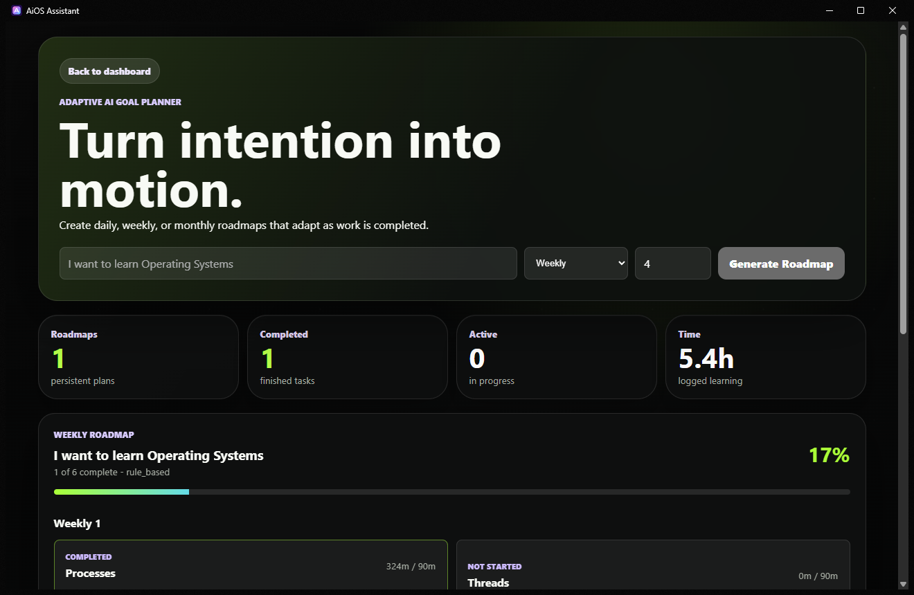
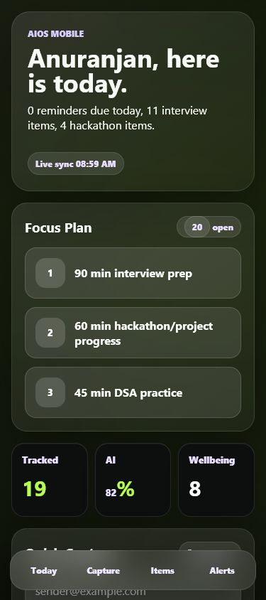
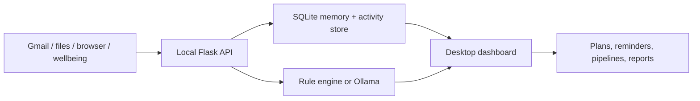
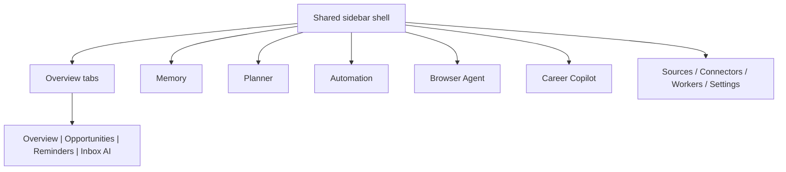

# AiOS Assistant

<p align="center">
  
</p>

<h3 align="center">Your local AI life operating system</h3>

<p align="center">
  Memory, Gmail, projects, learning and daily plans in one private workspace.
</p>

<p align="center">
  
  
  
  
</p>

AiOS is the personal assistant layer for **What Do You Do** and the wider AiOS idea: it runs on your machine, keeps data local, and turns scattered signals into a clean daily workspace.

<p align="center">
  
</p>

## See It In Motion

| Overview | Opportunities |
| --- | --- |
|  |  |

| Memory | Profile |
| --- | --- |
|  |  |

| Planner | Mobile companion |
| --- | --- |
|  |  |

## Two Apps, One Private Loop

| App | Job |
| --- | --- |
| **[What Do You Do](https://github.com/AnuranjanJain/what-do-you-do)** | Observes activity and answers where the day went. |
| **AiOS Assistant** | Connects mail, projects and memory, then decides what should happen next. |

They communicate only through loopback APIs. Raw activity and email content stay on the device.

## What It Does

- Remembers projects, goals, learning paths, notes, and next actions.
- Tracks hackathons, job updates, Gmail signals, reminders, and wellbeing events.
- Owns Email Intelligence: multi-account Gmail OAuth, encrypted local tokens, local email sync, AI understanding, semantic search, and daily/weekly planning.
- Turns hackathons, repos, email tasks, learning videos, and goals into one planning board with work done, work left, deadlines, and next questions.
- Runs local desktop automation previews before touching files.
- Plans goals into daily, weekly, or monthly roadmaps.
- Connects with Gmail OAuth and local import folders.
- Keeps AI local-first with Ollama support and rule-based fallback.
- Ships as an installable Windows desktop app plus Arch/Linux packaging.

## Local-First Workflow



## Email Intelligence

AiOS is the integration and planning brain for WDYD v2. It owns Google OAuth, Gmail sync, token encryption, local email storage, Ollama analysis, daily/weekly plans, follow-up suggestions, and semantic search.

Local APIs exposed to WDYD and other loopback clients:

```text
GET  /api/intelligence/accounts
POST /api/intelligence/accounts/google/connect
GET  /api/oauth/google/sign-in/<job-id>
POST /api/oauth/google/sign-in/<job-id>/continue
POST /api/oauth/google/sign-in/<job-id>/cancel
PATCH/DELETE /api/intelligence/accounts/<id>
POST /api/intelligence/accounts/<id>/sync
POST /api/intelligence/sync
GET  /api/intelligence/today
POST /api/intelligence/daily-plan
POST /api/intelligence/weekly-plan
GET  /api/intelligence/search?q=internship
GET  /api/planning-events
POST /api/planning-events
PATCH /api/planning-events/<id>
```

Email content is never sent to cloud AI providers by this module. Analysis uses Ollama when available and a deterministic local fallback otherwise.

Google sign-in runs as a cancellable background job. AiOS stays responsive,
shows the browser handoff state, and returns HTTP `202` plus polling URLs to API
clients instead of blocking a request while the OAuth browser is open.

The command planner is the bridge for real-life planning. It creates one row per event, keeps progress notes local, preserves your manual updates across refreshes, refreshes linked repo activity when possible, and exposes today/week/month agenda summaries plus timed plan blocks for WDYD.

When email analysis extracts a deadline such as `today`, `tomorrow`, `by Friday`, or a numeric date, the generated email task carries that due date into the command planner row.

For private GitHub repos or fewer rate-limit headaches, set `GITHUB_TOKEN` in Settings. AiOS uses it locally only when fetching latest linked repo activity.

### Ollama On A 4GB RTX 3050

Use smaller or quantized local models first:

```powershell
ollama pull qwen2.5:3b
ollama pull llama3.2:3b
ollama pull gemma2:2b
```

Recommended settings:

```text
AI_PROVIDER=ollama
OLLAMA_URL=http://localhost:11434
OLLAMA_MODEL=qwen2.5:3b
OLLAMA_EMBED_MODEL=nomic-embed-text
```

The rule-based fallback still extracts urgent emails, deadlines, and action items when Ollama is offline.

Use **Settings -> Test Ollama** to check the local Ollama server and whether the selected model is installed. AiOS refuses non-loopback Ollama URLs so email/planner content stays local.

Manage Gmail from **Settings -> Google account**:

- select **Sign in with Google** to connect the first account
- select **Add another Google account** for additional accounts
- rename an account
- pause or resume sync
- sync one account or all accounts
- remove an account, revoke Google access, and delete its local token

The installed app includes its Google desktop client configuration. Users never
paste keys or import JSON. The browser flow uses PKCE, a random loopback port,
account selection, and read-only Gmail access. See
[Gmail OAuth](docs/GMAIL_OAUTH_SETUP.md) for privacy and release-maintainer notes.

Set `EMAIL_SYNC_INTERVAL_MINUTES` in Settings to control continuous background sync. The worker enforces a 2-minute minimum to avoid hammering Gmail.

## Desktop Shell



Everything important now uses the same shell, top pipeline rail, profile button, and smooth page motion.

## Quick Start

```powershell
python -m venv .venv
.\.venv\Scripts\Activate.ps1
pip install -r requirements.txt
copy .env.example .env
python run.py
```

Open:

```text
http://127.0.0.1:5000
```

Run the packaged desktop build:

```powershell
.\release\AiOS-Assistant.exe
```

Build and install the desktop app:

```powershell
.\scripts\build-desktop.ps1
.\scripts\install-desktop.ps1 -EnableStartup
```

The installer copies `AiOS-Assistant.exe` to `%LOCALAPPDATA%\Programs\AiOS Assistant`, adds Start Menu/Desktop shortcuts, and can enable login startup. The startup launcher opens AiOS in background tray mode; closing the desktop window hides it to the tray until you use **Exit AiOS** from Settings or the tray menu. When the desktop app starts, it owns the background loops for reminders, imports, opportunities, and activity tracking.

Arch/Linux:

```bash
./scripts/build-desktop-arch.sh
tar -xzf release/AiOS-Assistant-arch-x86_64.tar.gz -C /tmp/aios
/tmp/aios/install-arch.sh --enable-startup
```

## Optional Local AI

AiOS works without a model by using deterministic local rules. For local LLM planning/classification:

```powershell
ollama pull qwen2.5:3b
ollama pull nomic-embed-text
```

Set in `.env`:

```env
AI_PROVIDER=ollama
OLLAMA_MODEL=qwen2.5:3b
OLLAMA_EMBED_MODEL=nomic-embed-text
```

## Repo Map

```text
app/
  routes.py              Desktop pages, API endpoints, OAuth routes
  models.py              SQLite models
  services/              Memory, planner, email intelligence, connectors, workers, settings
  templates/             Shared desktop shell and pages
  static/                CSS, JS, manifest, icons

automation_agent/        Local file and office automation tools
browser_agent/           Browser research and job tracking planner
career_agent/            GitHub, resume, roadmap, and job match logic
docs/                    Architecture, QA, screenshots, module specs
extension/               Browser/plugin companion surface
packaging/               Desktop release helpers
tests/                   Regression and integration tests
```

## Main Pages

| Page | Purpose |
| --- | --- |
| `/` | Desktop overview with tabbed Overview, Opportunities, Reminders, Inbox AI |
| `/gmail` | Gmail intelligence feed |
| `/hackathons` | Hackathon corner |
| `/jobs` | Placement and job tracker |
| `/wellbeing` | What Do You Do / activity signals |
| `/memory` | Persistent personal memory |
| `/planner` | Goal planner |
| `/automation` | Desktop automation preview and approval |
| `/browser-agent` | Browser research and job search agent |
| `/career` | Career Copilot |
| `/profile` | Name, role, current focus, profile photo |
| `/connectors` | Gmail and import connectors |
| `/workers` | Desktop background service status |
| `/settings` | Local config, PIN lock, desktop startup |

## Safety Notes

- Credentials stay out of git: `credentials/`, `.env`, `instance/`, `release/`, `dist/`, and `build/` are ignored.
- Gmail tokens live locally.
- OAuth refresh tokens are encrypted before storage.
- Destructive automation uses previews and approval.
- Local API pairing is loopback-only and token protected.
- Cloud AI is optional; local-first is the default design.

## Useful Commands

```powershell
python -m pytest -q
python -m pip_audit -r requirements.txt
python -m PyInstaller --clean --noconfirm desktop_app.spec
```

## Deep Dives

- [Architecture](ARCHITECTURE.md)
- [Desktop Installation](docs/DESKTOP_INSTALLATION.md)
- [Desktop Automation Agent](docs/AUTOMATION_AGENT.md)
- [Browser Automation Agent](docs/BROWSER_AUTOMATION_AGENT.md)
- [Career Copilot](docs/CAREER_COPILOT.md)
- [Pre-release QA Audit](docs/PRE_RELEASE_QA_AUDIT.md)
- [UI/UX Modernization Audit](docs/UI_UX_MODERNIZATION_AUDIT.md)
