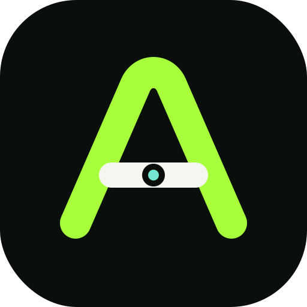
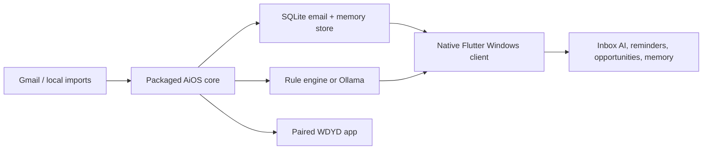
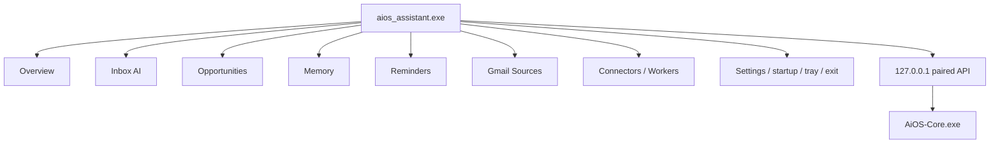

# AiOS Assistant

<p align="center">
  
</p>

<h3 align="center">Your local AI life operating system</h3>

<p align="center">
  Gmail intelligence, opportunities, reminders, and durable memory in one private workspace.
</p>

<p align="center">
  
  
  
  
  
  
</p>

AiOS is the personal assistant layer for **What Do You Do** and the wider AiOS idea: it runs on your machine, keeps data local, and turns scattered signals into a clean daily workspace.

This `windows-native` branch is the Windows installed-app delivery line. The
native Flutter client owns the visible experience, while the packaged local core
owns Gmail, OAuth tokens, workers, SQLite, Ollama, and loopback APIs. A browser is
opened only for Google's OAuth approval and can be closed immediately afterward.

The Linux/browser implementation is preserved on the
[`linux-browser`](https://github.com/AnuranjanJain/aios-assistant/tree/linux-browser)
branch.

## Two Apps, One Private Loop

| App | Job |
| --- | --- |
| **[What Do You Do](https://github.com/AnuranjanJain/what-do-you-do)** | Owns activity, projects, wellbeing, college/PAT, and daily planning. |
| **AiOS Assistant** | Owns Gmail intelligence, opportunities, reminders, memory, connectors, and background sync. |

They communicate only through loopback APIs. Raw activity and email content stay on the device.

## What It Does

- Remembers projects, goals, learning paths, notes, checkpoints, and next actions.
- Tracks hackathons, job updates, Gmail signals, and reminders.
- Owns Email Intelligence: multi-account Gmail OAuth, encrypted local tokens, local email sync, AI understanding, semantic search, and daily/weekly planning.
- Exposes planning and project intelligence to WDYD over a paired loopback API.
- Connects with Gmail OAuth and local import folders.
- Keeps AI local-first with Ollama support and rule-based fallback.
- Ships as an installable Windows desktop app plus Arch/Linux packaging.

## Local-First Workflow



## Email Intelligence

AiOS is the integration and planning brain for WDYD v2. It owns Google OAuth, Gmail sync, token encryption, local email storage, Ollama analysis, daily/weekly plans, follow-up suggestions, and semantic search.

Local APIs exposed to WDYD and other loopback clients:

```text
GET  /api/intelligence/accounts
POST /api/intelligence/accounts/google/connect
GET  /api/oauth/google/sign-in/<job-id>
POST /api/oauth/google/sign-in/<job-id>/continue
POST /api/oauth/google/sign-in/<job-id>/cancel
PATCH/DELETE /api/intelligence/accounts/<id>
POST /api/intelligence/accounts/<id>/sync
POST /api/intelligence/sync
GET  /api/intelligence/today
POST /api/intelligence/daily-plan
POST /api/intelligence/weekly-plan
GET  /api/intelligence/search?q=internship
GET  /api/planning-events
POST /api/planning-events
PATCH /api/planning-events/<id>
```

Email content is never sent to cloud AI providers by this module. Analysis uses Ollama when available and a deterministic local fallback otherwise.

Google sign-in runs as a cancellable background job. AiOS stays responsive,
shows the browser handoff state, and returns HTTP `202` plus polling URLs to API
clients instead of blocking a request while the OAuth browser is open.

The command planner is the bridge for real-life planning. It creates one row per event, keeps progress notes local, preserves your manual updates across refreshes, refreshes linked repo activity when possible, and exposes today/week/month agenda summaries plus timed plan blocks for WDYD.

When email analysis extracts a deadline such as `today`, `tomorrow`, `by Friday`, or a numeric date, the generated email task carries that due date into the command planner row.

For private GitHub repos or fewer rate-limit headaches, set `GITHUB_TOKEN` in Settings. AiOS uses it locally only when fetching latest linked repo activity.

### Ollama On A 4GB RTX 3050

Use smaller or quantized local models first:

```powershell
ollama pull qwen2.5:3b
ollama pull llama3.2:3b
ollama pull gemma2:2b
```

Recommended settings:

```text
AI_PROVIDER=ollama
OLLAMA_URL=http://localhost:11434
OLLAMA_MODEL=qwen2.5:3b
OLLAMA_EMBED_MODEL=nomic-embed-text
```

The rule-based fallback still extracts urgent emails, deadlines, and action items when Ollama is offline.

Use **Settings -> Test Ollama** to check the local Ollama server and whether the selected model is installed. AiOS refuses non-loopback Ollama URLs so email/planner content stays local.

Manage Gmail from **Settings -> Google account**:

- select **Sign in with Google** to connect the first account
- select **Add another Google account** for additional accounts
- rename an account
- pause or resume sync
- sync one account or all accounts
- remove an account, revoke Google access, and delete its local token

The installed app includes its Google desktop client configuration. Users never
paste keys or import JSON. The browser flow uses PKCE, a random loopback port,
account selection, and read-only Gmail access. See
[Gmail OAuth](docs/GMAIL_OAUTH_SETUP.md) for privacy and release-maintainer notes.

Set `EMAIL_SYNC_INTERVAL_MINUTES` in Settings to control continuous background sync. The worker enforces a 2-minute minimum to avoid hammering Gmail.

## Native Windows Shell



The Flutter shell renders real local data and starts the adjacent core
automatically. Close and minimize move the window to the tray; explicit Exit
stops both processes.

## Platform Branches

| Branch | Product surface |
| --- | --- |
| `windows-native` | Native Flutter client plus packaged local connector core |
| `linux-browser` | Flask/browser dashboard and Linux packaging |

## Windows Install

Build and install the desktop app:

```powershell
.\scripts\build-windows-native.ps1
powershell.exe -NoProfile -ExecutionPolicy Bypass -File .\native_app\windows\install\install.ps1
```

The installer copies `aios_assistant.exe`, `AiOS-Core.exe`, Flutter DLLs, and
the Flutter data directory to `%LOCALAPPDATA%\Programs\AiOS Assistant`. It adds
Start Menu and Desktop shortcuts, so Windows Search can launch the app. Enable
background login startup from the native Settings page. Closing the desktop
window hides it to the tray until you choose **Exit AiOS** from Settings or the
tray menu.

Windows users do not run `python run.py`, Vite, or a permanent browser tab. The
installed app starts its packaged local core automatically.

Linux development and packaging remain on the `linux-browser` branch.

Arch/Linux on that branch:

```bash
./scripts/build-desktop-arch.sh
tar -xzf release/AiOS-Assistant-arch-x86_64.tar.gz -C /tmp/aios
/tmp/aios/install-arch.sh --enable-startup
```

## Optional Local AI

AiOS works without a model by using deterministic local rules. For local LLM planning/classification:

```powershell
ollama pull qwen2.5:3b
ollama pull nomic-embed-text
```

Set in `.env`:

```env
AI_PROVIDER=ollama
OLLAMA_MODEL=qwen2.5:3b
OLLAMA_EMBED_MODEL=nomic-embed-text
```

## Repo Map

```text
app/
  routes.py              Local API and OAuth endpoints
  models.py              SQLite models
  services/              Memory, planner, email intelligence, connectors, workers, settings
  templates/             Linux/browser client templates
  static/                Linux/browser assets and packaged core resources

native_app/              Flutter Windows client
  lib/src/               native shell, controller, API and core manager
  windows/runner/        Win32 window, tray and lifecycle channel
  windows/install/       per-user installer and uninstaller

aios_core.spec           headless Windows core package
scripts/build-windows-native.ps1
                         builds the core, Flutter client and release ZIP

automation_agent/        Incubating standalone module; not shown in AiOS
browser_agent/           Incubating standalone module; not shown in AiOS
career_agent/            Incubating standalone module; not shown in AiOS
docs/                    Architecture, QA, screenshots, module specs
extension/               Browser/plugin companion surface
packaging/               Desktop release helpers
tests/                   Regression and integration tests
```

## Native Pages

| Page | Purpose |
| --- | --- |
| Overview | Gmail intelligence, reminders, and opportunity signals |
| Inbox AI | Local email summaries and urgent actions |
| Opportunities | Grouped jobs, hackathons, achievements and deadlines |
| Reminders | Due and upcoming actions extracted locally |
| Memory | Search, entities, notes, project checkpoints, and next actions |
| Sources | One-click multi-account Google sign-in and sync |
| Connectors | Local pipeline health and manual sync |
| Workers | Background email, reminder, import, and opportunity services |
| Settings | Core health, theme, Windows startup, tray and exit |

## Safety Notes

- Credentials stay out of git: `credentials/`, `.env`, `instance/`, `release/`, `dist/`, and `build/` are ignored.
- Gmail tokens live locally.
- OAuth refresh tokens are encrypted before storage.
- Activity collection belongs to WDYD; AiOS does not run a second desktop tracker.
- Local API pairing is loopback-only and token protected.
- Cloud AI is optional; local-first is the default design.

## Useful Commands

```powershell
python -m pytest -q
python -m pip_audit -r requirements.txt
python -m PyInstaller --clean --noconfirm aios_core.spec
cd native_app
C:\Users\anura\development\flutter\bin\flutter.bat analyze
C:\Users\anura\development\flutter\bin\flutter.bat test
```

## Deep Dives

- [Architecture](ARCHITECTURE.md)
- [Desktop Installation](docs/DESKTOP_INSTALLATION.md)
- [Desktop Automation Agent](docs/AUTOMATION_AGENT.md)
- [Browser Automation Agent](docs/BROWSER_AUTOMATION_AGENT.md)
- [Career Copilot](docs/CAREER_COPILOT.md)
- [Pre-release QA Audit](docs/PRE_RELEASE_QA_AUDIT.md)
- [UI/UX Modernization Audit](docs/UI_UX_MODERNIZATION_AUDIT.md)
