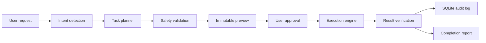

# AiOS Desktop Automation Agent

## Mission

AiOS converts a natural-language request into a previewable, approved, locally executed desktop task. Files, screenshots, office documents, plans, and audit records stay on the user's device.

## Workflow



## Folder Structure

```text
automation_agent/
  api.py              FastAPI boundary
  config.py           local paths and limits
  engine.py           plan, approve, execute, verify
  planner.py          deterministic intent mapping
  safety.py           root and approval validation
  store.py            SQLite audit store
  schema.sql          portable database schema
  tools/
    base.py           tool result contract
    desktop.py        opt-in PyAutoGUI/xdotool controls
    files.py          file and archive operations
    office.py         DOCX, PPTX, XLSX, LibreOffice PDF
    screenshots.py    local OCR and error hints
```

The existing Flask desktop app calls this package in-process. A Linux client or another AiOS surface can use the loopback FastAPI service instead:

```powershell
python -m automation_agent.server
```

The API listens only on `127.0.0.1:5065`.

## Database Schema

`automation_plan` stores the original request, detected intent, risk level, approval hash, state, and timestamps.

`automation_action` stores ordered tool calls, serialized arguments, execution state, verified result, errors, and timing. The plaintext approval token is never stored in SQLite.

## Tool Abstraction

All tools return the same result contract:

```json
{
  "ok": true,
  "summary": "Organized 12 files.",
  "changed_paths": ["C:/Users/.../Downloads/Documents/file.pdf"],
  "data": {},
  "reversible": false
}
```

This keeps the planner independent from Windows, Arch Linux, Flask, FastAPI, and future local-model implementations.

## Security Layer

- Dry preview before every execution.
- One-time plan approval token.
- Explicit allowed roots, defaulting to Desktop, Documents, and Downloads.
- Blocks `.git`, `.ssh`, credentials, AppData, Windows, and System32 paths.
- Deletes move data into AiOS quarantine and can be restored.
- Archive extraction rejects path traversal, oversized archives, and excessive entries.
- Batch limits prevent accidental whole-disk operations.
- Every action is written to SQLite before and after execution.
- Foreground clicks and typing are disabled by default.
- No shell command generated from natural-language text is executed.
- No cloud API is needed.

## MVP Features

- Organize a folder by file type.
- Create subject folders.
- Move, rename, quarantine, and restore files.
- Find duplicate files with SHA-256.
- Compress ZIP files and safely extract ZIP/TAR archives.
- Create DOCX, PPTX, and XLSX files.
- Generate a DOCX weekly report from Excel workbooks.
- Convert office documents to PDF through local LibreOffice.
- Extract screenshot text with local Tesseract OCR and flag common error terms.
- Expose plan, execution, restore, capabilities, and health APIs.
- Show plans and audit history in the AiOS desktop UI.

## Local Dependencies

- Python packages are in `requirements.txt`.
- LibreOffice supplies PDF conversion.
- Tesseract supplies screenshot OCR.
- Windows foreground automation uses PyAutoGUI.
- Arch Linux foreground automation uses `xdotool`.

Missing optional binaries are reported as unavailable in the dashboard. Core file automation continues to work.

## Implementation Plan

1. MVP: deterministic local intents, guarded file tools, office creation, OCR, audit history.
2. Local reasoning: use Ollama to produce schema-validated plans while retaining deterministic safety validation.
3. Background rules: watched folders and scheduled plans, with explicit per-rule permissions.
4. Rich verification: document rendering checks, screenshot comparison, and rollback across multi-action plans.
5. Cross-platform shell: package the same core in Windows and Arch desktop releases.

## Future Enhancements

- Fine-grained per-folder permission prompts.
- Human-readable diffs before document edits.
- Encrypted automation database.
- Local semantic search over prior tasks.
- Voice commands with local speech recognition.
- Wayland automation through supported desktop portals.
- Multi-step rollback for moves, renames, and generated artifacts.
- Signed tool plugins with declared permissions.
