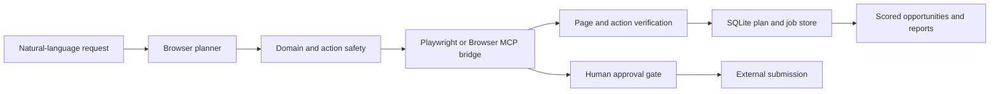

# AiOS Browser Automation Agent

## Architecture



The browser agent is a separate local subsystem. It shares the AiOS desktop surface but does not inherit desktop file permissions or Gmail credentials.

## Folder Structure

```text
browser_agent/
  api.py          FastAPI endpoints
  config.py       local storage, domain allowlist, run limits
  engine.py       execution and approval orchestration
  planner.py      natural-language intent plans
  safety.py       URL, field, and side-effect classification
  scoring.py      local job/profile matching
  store.py        SQLite plans, jobs, and applications
  tools.py        Playwright tools and Browser MCP bridge
```

## Browser Tool Layer

The Playwright backend supports:

- opening and navigating approved websites
- exact, verified clicks
- label-based form preparation
- structured page and job extraction
- controlled downloads into the AiOS data directory
- tab listing, creation, switching, and closing

`BrowserMCPBridge` accepts the same structured operations through a trusted host. This lets a future AiOS process use an existing logged-in browser without coupling the planner to a particular browser implementation.

## Job Search Pipeline

1. Detect the job-search intent, source, query, location, and result limit.
2. Validate the generated URL against the domain allowlist.
3. Open the page through Playwright or Browser MCP.
4. Extract visible job cards and normalize title, company, URL, description, and skills.
5. Score each opportunity against local skills, project technologies, experience, and resume keywords.
6. Save results to SQLite and show them in the AiOS dashboard.
7. Track status as saved, applied, interview, assessment, rejected, or offer.

Site markup changes frequently. Source adapters are intentionally replaceable and must use visible, verified page state rather than bypassing access controls.

## Opportunity Scoring

The deterministic MVP score is:

- skill overlap: 55 points
- project evidence: 20 points
- resume keyword overlap: 15 points
- experience alignment: 10 points

The dashboard stores both the percentage and a human-readable reason. A local Ollama model can later enrich explanations, but it must not silently alter the underlying numeric evidence.

## Database Design

`browser_plan` stores the request, intent, risk, approval hash, status, and timestamps.

`browser_action` stores ordered operations, arguments, risk, result, error, and timing.

`job_opportunity` stores normalized job data, skills, match score, reasoning, source URL, and tracking status.

`job_application` stores the selected resume version, cover-letter draft, prepared answers, current status, and application timestamp.

## Security Model

- Loopback-only FastAPI service on `127.0.0.1:5066`.
- Explicit domain allowlist; private, loopback, credential-bearing, and unknown URLs are rejected.
- Read-only research actions and external side effects are different permission classes.
- Login credentials, passwords, OTPs, and CAPTCHA answers are never generated or stored.
- Form fields are addressed by visible labels and must resolve uniquely.
- Clicks with apply, buy, pay, send, submit, or confirm semantics are blocked.
- The MVP cannot perform a final application submission.
- Downloads are stored only under the local AiOS browser-agent directory.
- Page content is treated as untrusted data and cannot change the agent's policy.
- Runs and results are recorded locally for review.
- Result and page limits reduce accidental crawling and account lockouts.
- Respect website terms, robots policies, and rate limits. Do not bypass bot detection or access controls.

## FastAPI

Run the standalone service:

```powershell
python -m browser_agent.server
```

Install Chromium once for the local Playwright runtime:

```powershell
python -m playwright install chromium
```

Endpoints:

- `GET /health`
- `GET /capabilities`
- `GET /plans`
- `POST /plans`
- `POST /plans/{id}/execute`
- `GET /opportunities`

## MVP

- Natural-language job and research plans
- LinkedIn, Internshala, Wellfound, Naukri, and Indeed source routing
- Structured Playwright browser tools
- Browser MCP bridge contract
- Local job extraction and scoring
- Application status tracking
- Resume and cover-letter preparation fields
- Human approval stop before submission
- FastAPI and AiOS desktop UI

## Future Scaling

1. Versioned per-site adapters with selector health checks.
2. Browser extension or CDP bridge for user-owned authenticated sessions.
3. Local resume parsing and embedding-based scoring.
4. Scheduled research with per-domain quotas and backoff.
5. Diff-based monitoring for changed job descriptions and deadlines.
6. Signed browser-tool plugins with declared domains and permissions.
7. Encrypted local profile and application artifacts.
8. A supervised submission mode with action-time confirmation for every external write.
