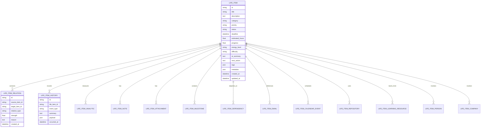
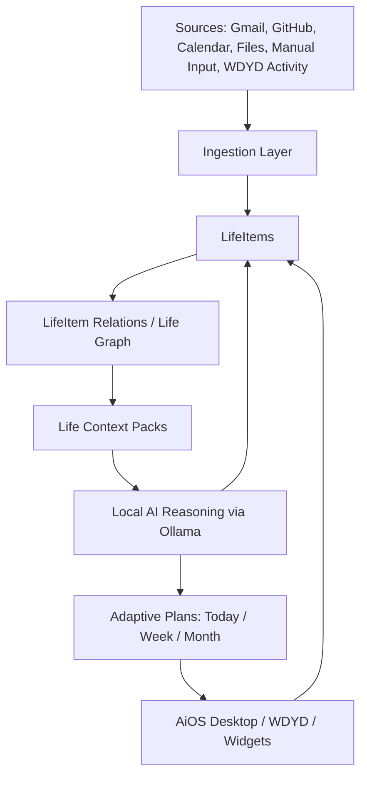

# AiOS Life Operating System Architecture

## 1. Architecture Goal

AiOS revolves around one universal model: `LifeItem`.

Every meaningful object in the user's life becomes a `LifeItem`: project, hackathon, internship, learning course, assignment, contest, meeting, reminder, email, goal, idea, research item, personal task, repository, note, deadline, or follow-up.

The planner is not the core system. Planning is a generated view over the LifeItem graph.

## 2. Core Model

### LifeItem

`LifeItem` is the canonical object.

Required conceptual fields:

- `id`
- `title`
- `description`
- `category`
- `priority`
- `status`
- `deadline`
- `estimated_hours`
- `progress`
- `energy_level`
- `difficulty`
- `repository`
- `calendar_events`
- `emails`
- `notes`
- `attachments`
- `milestones`
- `dependencies`
- `people`
- `companies`
- `tags`
- `learning_resources`
- `analytics`
- `history`
- `ai_summary`
- `next_action`

Design rule:

```text
Everything references LifeItems.
Integrations do not create isolated planner/task objects.
They create or update LifeItems and LifeItem relations.
```

## 3. ER Diagram



## 4. Database Schema

### `life_items`

Primary table.

```text
id
title
description
category
priority
status
deadline
estimated_hours
progress
energy_level
difficulty
ai_summary
next_action
tags_json
metadata_json
created_at
updated_at
```

Recommended indexes:

```text
category
status
priority
deadline
updated_at
```

### `life_item_relations`

Connects LifeItems to each other.

```text
id
source_item_id
target_item_id
relation_type
strength
reason
metadata_json
created_at
```

Relation examples:

```text
belongs_to
depends_on
blocks
has_deadline
has_repo
has_email
has_note
has_meeting
has_resource
mentions_person
mentions_company
generated_from
scheduled_for
```

### Supporting Tables

```text
life_item_notes
life_item_attachments
life_item_milestones
life_item_dependencies
life_item_emails
life_item_calendar_events
life_item_repositories
life_item_learning_resources
life_item_people
life_item_companies
life_item_history
life_item_analytics
```

These tables store source-specific details while still referencing `life_item_id`.

## 5. Existing System Migration Map

Current objects should migrate toward LifeItems:

```text
PlanningEvent -> LifeItem
EmailTask -> LifeItem
EmailMessage -> LifeItem or life_item_emails
Opportunity(kind=hackathon) -> LifeItem
PlanTask -> LifeItem
Reminder -> LifeItem
Repository activity -> life_item_repositories + life_item_history
Progress note -> life_item_history
```

Temporary compatibility:

```text
Existing planner APIs can continue to exist as projections over LifeItems.
PlanningEvent can remain during migration, but should not be the long-term center.
```

## 6. Folder Structure

Recommended backend structure:

```text
app/
  life/
    __init__.py
    models.py
    schemas.py
    routes.py
    services/
      life_item_service.py
      life_graph_service.py
      life_context_service.py
      life_planner_service.py
      life_ai_service.py
      life_scoring_service.py
      life_search_service.py
    workers/
      life_sync_worker.py
      life_ai_worker.py
      life_planner_worker.py
      life_analytics_worker.py
      life_notification_worker.py

  integrations/
    gmail/
    google_calendar/
    github/
    ollama/
    files/
    notifications/
```

Recommended WDYD structure:

```text
flutter_app/lib/src/life/
  life_models.dart
  life_api.dart
  life_dashboard.dart
  life_item_detail.dart
  life_planner_view.dart
  life_graph_view.dart
```

## 7. API Design

### LifeItem CRUD

```text
GET    /api/life/items
POST   /api/life/items
GET    /api/life/items/:id
PATCH  /api/life/items/:id
DELETE /api/life/items/:id
```

### Graph

```text
GET  /api/life/items/:id/graph
POST /api/life/items/:id/relations
GET  /api/life/graph/search?q=
```

### Planning

```text
GET  /api/life/plan/today
GET  /api/life/plan/week
GET  /api/life/plan/month
POST /api/life/plan/regenerate
POST /api/life/items/:id/progress
```

### Integrations

```text
POST /api/life/sync/gmail
POST /api/life/sync/github
POST /api/life/sync/calendar
POST /api/life/sync/files
POST /api/life/sync/all
```

### AI

```text
POST /api/life/items/:id/summarize
POST /api/life/items/:id/next-action
POST /api/life/items/:id/score
POST /api/life/search
```

## 8. Service Design

### `LifeItemService`

- Create, update, archive, restore LifeItems.
- Own validation and normalization.
- Ensure every integration writes to the universal model.

### `LifeGraphService`

- Create and score relations.
- Traverse connected context.
- Explain why two LifeItems are connected.

### `LifeContextService`

- Gather related emails, repos, notes, calendar events, people, companies, milestones, and history.
- Produce context packs for local AI.

### `LifePlannerService`

- Generate today/week/month plans from LifeItems.
- Respect deadline, priority, energy, difficulty, progress, dependencies, and available time.
- Produce planner projections rather than owning separate task truth.

### `LifeAIService`

- Use Ollama for summaries, next actions, blockers, classification, and reasoning.
- Use rule-based fallback when Ollama is unavailable.
- Keep all private reasoning local.

### `LifeScoringService`

- Calculate urgency, priority, deadline risk, stale-work risk, difficulty, energy fit, and next-best-action score.

### `LifeSearchService`

- Provide keyword search initially.
- Add local embeddings later.

## 9. Worker Design

### `life_sync_worker`

- Sync Gmail, GitHub, Calendar, files, and external sources.
- Upsert LifeItems and relations.

### `life_ai_worker`

- Refresh AI summaries, blockers, next actions, and graph relation explanations.

### `life_planner_worker`

- Regenerate today/week/month planner projections.

### `life_analytics_worker`

- Update progress, stale items, risk scores, time estimates, and completion patterns.

### `life_notification_worker`

- Send local reminders, deadline warnings, follow-up prompts, and check-ins.

## 10. UI Navigation

Primary navigation:

```text
Home
Today
Week
Month
Life Graph
Life Items
Projects
Learning
Hackathons
Repos
People
Inbox
Search
Settings
```

Core screens:

### Life Dashboard

- Today focus
- Urgent LifeItems
- Blocked items
- Due soon
- Waiting for me
- Waiting for others
- Recent changes

### LifeItem Detail

- Summary
- Next action
- Why it matters
- Connected emails
- Connected repos
- Connected calendar events
- Notes
- Milestones
- Dependencies
- Progress history
- AI explanation

### Life Graph

- Visual map of connected LifeItems.
- Filter by project, deadline, person, company, repo, or source.

### Planner

- Today/week/month projections generated from LifeItems.
- Every row links back to a LifeItem.

## 11. Architecture Flow



## 12. Design Decisions

1. `LifeItem` is the source of truth.
2. Existing planner rows become projections, not canonical objects.
3. Every external source maps into LifeItems or LifeItem relations.
4. AI reasoning must be traceable back to LifeItems, relations, and history.
5. Local-first privacy remains mandatory.
6. Cloud APIs are sync sources only; reasoning should happen locally through Ollama whenever possible.

## 13. Non-Goals For This Phase

This architecture phase does not implement:

- Database migrations.
- New runtime APIs.
- UI feature rewrites.
- Calendar integration.
- Life graph visualization.
- Embedding search.
- Production migration from PlanningEvent to LifeItem.

Those belong to later implementation milestones.
